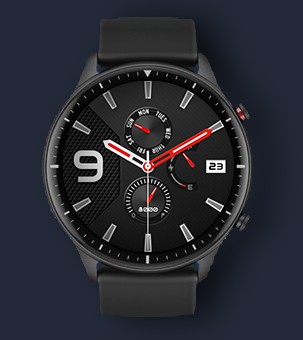
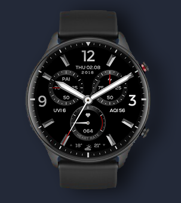
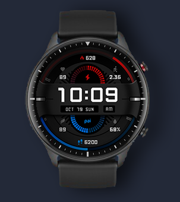
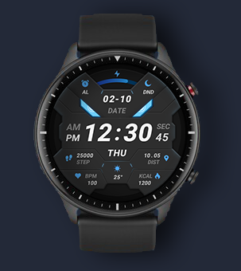

<html>
<head>
</head>
<body>

  <h2><strong>Amazfit GTR 2</strong></h2>

  

<a href="https://dl.dropboxusercontent.com/s/bujyzumy5n4yksm/01.bin">
    <figure class="card">

      

    </figure>
</a>
<a href="https://dl.dropboxusercontent.com/s/hynsmuf7f2an679/02.bin">
    <figure class="card">

      

    </figure>
</a>
<a href="https://dl.dropboxusercontent.com/s/z164bz9xu69kugn/03.bin">
    <figure class="card">

      

    </figure>
</a>
<a href="https://dl.dropboxusercontent.com/s/a807uxt2nuerkbk/04.bin">
    <figure class="card">

      

    </figure>
</a>
<a href="https://dl.dropboxusercontent.com/s/7witki8ekycfd1j/05.bin">
    <figure class="card">

      

    </figure>
</a>
<a href="https://dl.dropboxusercontent.com/s/rzj2eglr4fu0yb2/06.bin">
    <figure class="card">

      

    </figure>
</a>
<a href="https://dl.dropboxusercontent.com/s/m1b80xe8sh0v23u/07.bin">
    <figure class="card">

      

    </figure>
</a>
<a href="https://dl.dropboxusercontent.com/s/o0yue77jzkjmqz7/08.bin">
    <figure class="card">

      

    </figure>
</a>
<a href="https://dl.dropboxusercontent.com/s/bitu4zdjull1mrc/09.bin">
    <figure class="card">

      

    </figure>
</a>
<a href="https://dl.dropboxusercontent.com/s/gtxt0b5ejqxq2jq/10.bin">
    <figure class="card">

      

    </figure>
</a>
<a href="https://dl.dropboxusercontent.com/s/6c1nn9t6cqv33ay/11.bin">
    <figure class="card">

      

    </figure>
</a>
<a href="https://dl.dropboxusercontent.com/s/p9mqpjeqvg90vv0/12.bin">
    <figure class="card">

      

    </figure>
</a>
<a href="https://dl.dropboxusercontent.com/s/62dxo93s4pkfyyo/13.bin">
    <figure class="card">

      

    </figure>
</a>
<a href="https://dl.dropboxusercontent.com/s/gz4hjw10e6ekr33/14.bin">
    <figure class="card">

      

    </figure>
</a>
<a href="https://dl.dropboxusercontent.com/s/80yo09jo4iid66p/15.bin">
    <figure class="card">

      

    </figure>
</a>
<a href="https://dl.dropboxusercontent.com/s/firv23kcd2wyz81/16.bin">
    <figure class="card">

      

    </figure>
</a>
<a href="https://dl.dropboxusercontent.com/s/l70tdjadr972n7k/17.bin">
    <figure class="card">

      

    </figure>
</a>
<a href="https://dl.dropboxusercontent.com/s/xnqfyu6ogfyzxcl/18.bin">
    <figure class="card">

      

    </figure>
</a>
<a href="https://dl.dropboxusercontent.com/s/2caldj7ydk79ynp/19.bin">
    <figure class="card">

      

    </figure>
</a>
<a href="https://dl.dropboxusercontent.com/s/1ikyq5tu8cw48kv/20.bin">
    <figure class="card">

      

    </figure>
</a>
<a href="https://dl.dropboxusercontent.com/s/aa64iggvw5wzx52/21.bin">
    <figure class="card">

      

    </figure>
</a>
<a href="https://dl.dropboxusercontent.com/s/0d3zs13r16nmghh/22.bin">
    <figure class="card">

      

    </figure>
</a>
<a href="https://dl.dropboxusercontent.com/s/yuk14fj6hb5wqg6/23.bin">
    <figure class="card">

      

    </figure>
</a>
<a href="https://dl.dropboxusercontent.com/s/dcb701gwz5mlc1m/24.bin">
    <figure class="card">

      

    </figure>
</a>
<a href="https://dl.dropboxusercontent.com/s/3legjxtca59lvl5/25.bin">
    <figure class="card">

      

    </figure>
</a>
<a href="https://dl.dropboxusercontent.com/s/nquswboanggycj0/26.bin">
    <figure class="card">

      

    </figure>
</a>
<a href="https://dl.dropboxusercontent.com/s/yvmp2789eh20l5x/27.bin">
    <figure class="card">

      

      

    </figure>
</a>
<a href="https://dl.dropboxusercontent.com/s/zzujnof2o7ggo81/28.bin">
    <figure class="card">

      

      

    </figure>
</a>
<a href="https://dl.dropboxusercontent.com/s/p1xsakhpk83dasv/29.bin">
    <figure class="card">

      

      

    </figure>
</a>
<a href="https://dl.dropboxusercontent.com/s/4pc1zk606xkqoy0/30.bin">
    <figure class="card">

      

      

    </figure>
</a>
<a href="https://dl.dropboxusercontent.com/s/4qlwr4hoyvysvgg/31.bin">
    <figure class="card">

      

      

    </figure>
</a>
<a href="https://dl.dropboxusercontent.com/s/ztx5pdqqjd5qfip/32.bin">
    <figure class="card">

      

      

    </figure>
</a>
<a href="https://dl.dropboxusercontent.com/s/okxg1uk6qdu5k6a/33.bin">
    <figure class="card">

      

      

    </figure>
</a>
<a href="https://dl.dropboxusercontent.com/s/gulxzqqyeyetbfw/34.bin">
    <figure class="card">

      

      

    </figure>
</a>
<a href="https://dl.dropboxusercontent.com/s/ggj1ztsvm4hu4c8/35.bin">
    <figure class="card">

      

      

    </figure>
</a>
<a href="https://dl.dropboxusercontent.com/s/7aaiuzbqwkl2ohe/36.bin">
    <figure class="card">

      

      

    </figure>
</a>
<a href="https://dl.dropboxusercontent.com/s/je6ylzw5ghe0w08/37.bin">
    <figure class="card">

      

      

    </figure>
</a>
<a href="https://dl.dropboxusercontent.com/s/tipxjxz2hwp5z6k/38.bin">
    <figure class="card">

      

      

    </figure>
</a>
<a href="https://dl.dropboxusercontent.com/s/xhhxn83stitqy8e/39.bin">
    <figure class="card">

      

      

    </figure>
</a>
<a href="https://dl.dropboxusercontent.com/s/920rgf6s912q9nz/40.bin">
    <figure class="card">

      

      

    </figure>
</a>
<a href="https://dl.dropboxusercontent.com/s/fhv0s4c5a4kokt1/41.bin">
    <figure class="card">

      

      

    </figure>
</a>
<a href="https://dl.dropboxusercontent.com/s/8guvqzounro0c62/42.bin">
    <figure class="card">

      

      

    </figure>
</a>
<a href="https://dl.dropboxusercontent.com/s/ya5lodne5srqp81/43.bin">
    <figure class="card">

      

      

    </figure>
</a>
<a href="https://dl.dropboxusercontent.com/s/iem0vlu2rtabvdu/44.bin">
    <figure class="card">

      

      

    </figure>
</a>
<a href="https://dl.dropboxusercontent.com/s/d83iqyiqpnit6dk/45.bin">
    <figure class="card">

      

      

    </figure>
</a>
<a href="https://dl.dropboxusercontent.com/s/5gv348ibrla3wid/46.bin">
    <figure class="card">

      

      

    </figure>
</a>
<a href="https://dl.dropboxusercontent.com/s/n1tkh0134fmr1cn/47.bin">
    <figure class="card">

      

      

    </figure>
</a>
<a href="https://dl.dropboxusercontent.com/s/9c47mov94e89rlw/48.bin">
    <figure class="card">

      

      

    </figure>
</a>
<a href="https://dl.dropboxusercontent.com/s/tas0cqzsp321vq9/49.bin">
    <figure class="card">

      

      

    </figure>
</a>
<a href="https://dl.dropboxusercontent.com/s/pilo8q6o8hodl76/50.bin">
    <figure class="card">

      

      

    </figure>
</a>
<a href="https://dl.dropboxusercontent.com/s/ev09l1igiftf812/51.bin">
    <figure class="card">

      

      

    </figure>
</a>
  

</body>
</html>

